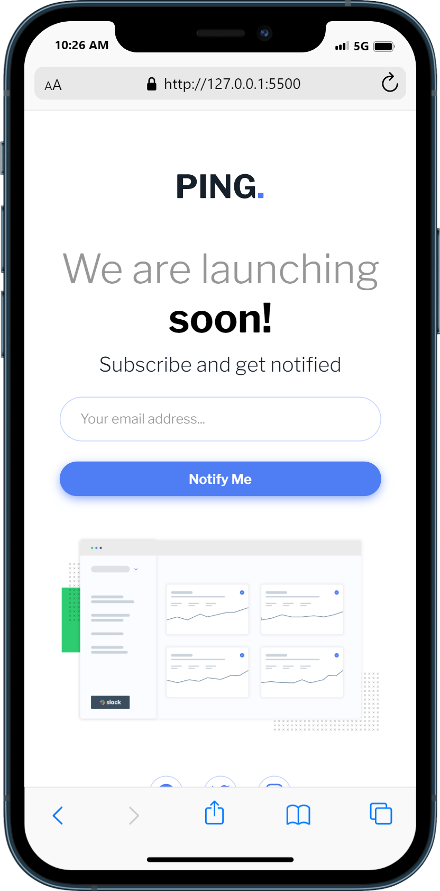

# Frontend Mentor - Ping coming soon page solution

This is a solution to the [Ping coming soon page challenge on Frontend Mentor](https://www.frontendmentor.io/challenges/ping-single-column-coming-soon-page-5cadd051fec04111f7b848da). Frontend Mentor challenges help you improve your coding skills by building realistic projects. 

## Table of contents

- [Overview](#overview)
  - [The challenge](#the-challenge)
  - [Screenshot](#screenshot)
  - [Links](#links)
- [My process](#my-process)
  - [Built with](#built-with)
- [Author](#author)

## Overview

### The challenge

Users should be able to:

- View the optimal layout for the site depending on their device's screen size
- See hover states for all interactive elements on the page

### Screenshot

### Links

- [Solution URL](https://www.frontendmentor.io/solutions/intro-component-with-signup-form-M4N1qnu9DZ)
- [Live Site URL](https://gleeful-kitsune-6e6ebd.netlify.app/)

## My process

### Built with

- Semantic HTML5 markup
- SCSS custom properties
- JQuery
- Responsive design

## Author

- Frontend Mentor - [@mhap75](https://www.frontendmentor.io/profile/mhap75)
- 